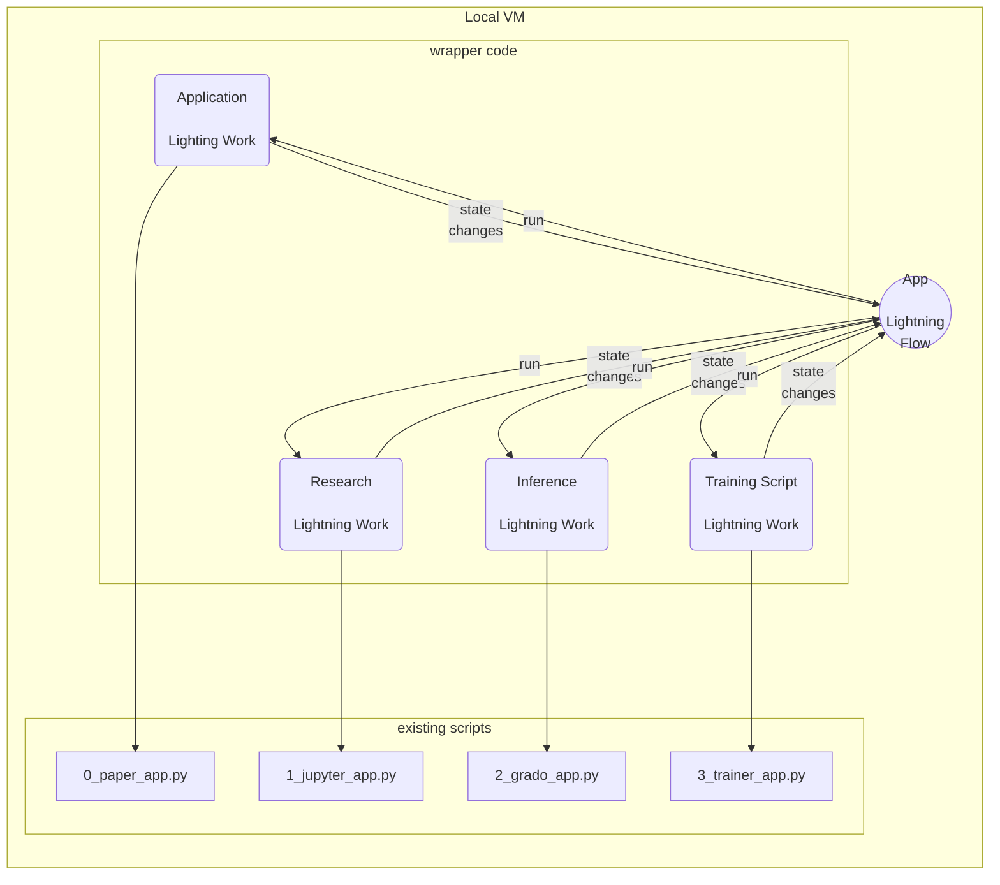

### Introduction
Lightning App is composed of Lightning Work and Lightning Flow. Start by wrapping existing scripts as Lightning Works. Lightning Works send state information to Lighting Flows. Lightning Flows send run command to Lightning Works. Distributed states and runs are serialized via event loops in Lightning Flows.



This is a demo lightning app that gradually shows us how to build applications step by step. Make sure that you execute the commands below. 

```
conda create -n ons python=3.8
conda activate ons

pip install lightning
pip install -r requirements.txt

# Optional - Convert Jupyter Notebook to python script
jupyter nbconvert --to script glaucoma-classification.ipynb
```

Edit `.env` file and replace it with `AWS` and `W&B` credentials. Please execute the appications below serially as the complexity level varies.

```
# Research PDF
python -m lightning run app 0_paper_app.py --cloud --open-ui False --name paper

# Jupyter APP
python -m lightning run app 1_jupyter_app.py --env WANDB_API_KEY=$WANDB_API_KEY \
--env DEMO_AWS_ACCESS_KEY_ID=$AWS_ACCESS_KEY_ID --env DEMO_AWS_SECRET_ACCESS_KEY=$AWS_SECRET_ACCESS_KEY \
--cloud --open-ui false --name jupyter

# Grado APP / Done
python -m lightning run app 2_grado_app.py --env WANDB_API_KEY=$WANDB_API_KEY  --cloud --open-ui false --name grado

# Trainer APP
python -m lightning run app 3_trainer_app.py --env WANDB_API_KEY=$WANDB_API_KEY \
--env DEMO_AWS_ACCESS_KEY_ID=$AWS_ACCESS_KEY_ID --env DEMO_AWS_SECRET_ACCESS_KEY=$AWS_SECRET_ACCESS_KEY \
--cloud --open-ui false --name trainer

# Demo (Training and Inference)
python -m lightning run app 4_demo_app.py --env WANDB_API_KEY=$WANDB_API_KEY \
--env DEMO_AWS_ACCESS_KEY_ID=$AWS_ACCESS_KEY_ID --env DEMO_AWS_SECRET_ACCESS_KEY=$AWS_SECRET_ACCESS_KEY \
--cloud --open-ui false --name demo
```

The final app `demo` shows how applications can organised in a sequence and executed serially. We also see an example of lighthing with 3rd party components like `W&B`, `Grado` etc.